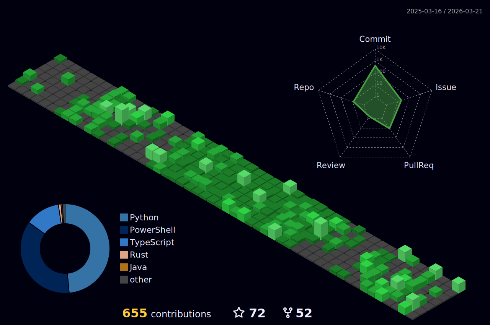

<link rel="stylesheet" href="https://cdn.jsdelivr.net/gh/devicons/devicon@v2.15.1/devicon.min.css">

<h3 align="center">I am a student in Vietnam also DevOps</h3>

- 🔭 I’m currently working on [Fantasy Bot](https://github.com/fantasybot-red/)

- 🌱 I’m currently learning **Rust**

- 💬 Ask me about **Python, Java, Javascript, Rust, Css...**

- 📫 How to reach me **duongtuan30306@gmail.** or **[https://thedt.is-a.dev/](https://thedt.is-a.dev/)**

<h3 align="center">Languages and Tools:</h3>

    

<h3 align="center">Discord</h3>

    
<h3 align="center">Github Stats ⚡</h3>

 
 

 
 

 
 

 
 

 

