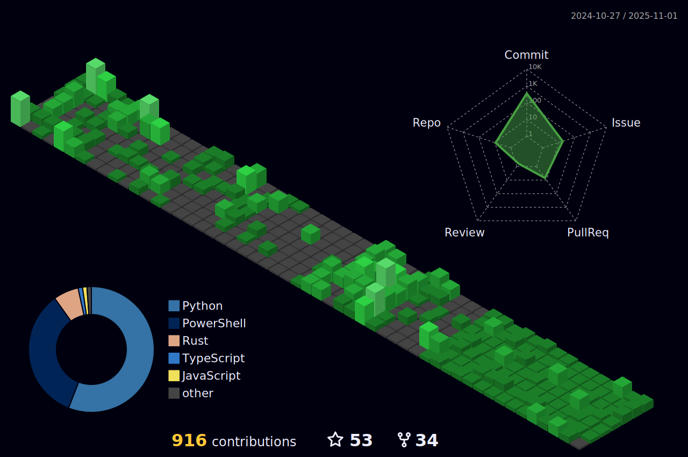

<h3 align="center">A normal human from vietnam</h3>

   📫 How to reach me: by <b>email</b> in description or <a href="https://thedt.id.vn/links/">
   <b>click here</b>
   </a>.

<h3 align="center">Languages and Tools i am using or has been use before</h3>

   <!-- Yes i know is a long list -->
   

<h3 align="center">Discord Status</h3>

<h3 align="center">Programming Experience 🪄</h3>

| Language               | Experience                                                                                                      |
|------------------------|------------------------------------------------------------------------------------------------------------------|
| **Rust**               | Able to make desktop apps using Tauri, code web servers, or WASM for web needing native logic and performance (e.g., image processing). |
| **Python**             | Coding AI wrappers and other tools like API wrappers.                                                            |
| **JavaScript / TypeScript** | Coding web apps and tasks involving the web or libraries that exist only in JS/TS or work better there.          |
| **Java**               | Know how to code and able to create some Minecraft plugins.                                                      |

<h3 align="center">Stats ⚡</h3>

 
   
    

    <h4 align="center">WakaApi Activity</h4>
    

 
   

